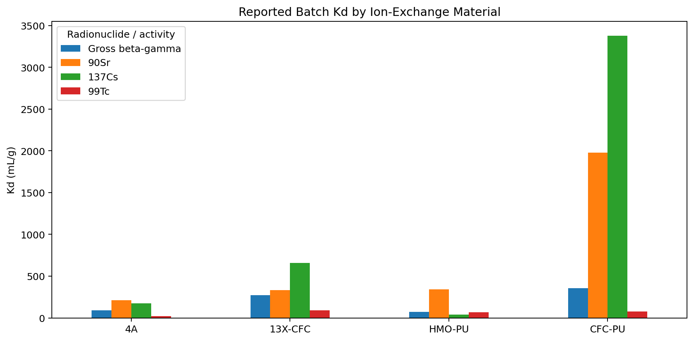

# Radioactive Liquid Waste Treatment — Data & Engineering Analytics

**Reproducible reconstruction and quantitative analysis of experimental work on ion-exchange treatment of low-level radioactive liquid waste (LLW).**

[](https://www.python.org/)
[](https://github.com/ssarswat/radioactive-liquid-waste-treatment/actions/workflows/tests.yml)
[](./app.py)
### 🚀 Live Interactive Dashboard

**[Open the Streamlit Dashboard](https://radioactive-liquid-waste-treatment-mjflecbcsawzzlvdnj2ld8.streamlit.app/)**
> **Scope and safety:** This is a research-analysis and portfolio repository, not a plant operating manual. It does not replace facility procedures, radiological protection controls, regulatory requirements, engineering design review, or qualified professional judgement.

## Project at a glance

The original experimental study evaluated synthetic zeolites and composite ion-exchange media for treatment of aqueous LLW, followed by laboratory column studies, pilot-scale observations, hydraulic analysis and spent-media management.

This repository turns that work into a **reproducible engineering analytics workflow**:

**source reconstruction → data validation → material comparison → operating-parameter analysis → column performance → hydraulic analysis → spent-media assessment → dashboard**

### Why this is more than a data-cleaning exercise

A high batch adsorption coefficient does not, by itself, establish the best process medium. The analysis therefore connects **batch performance** with **column behavior, hydraulic considerations, pilot observations and downstream spent-media management**.

---

## Key results from the reconstructed study

| Area | Source-derived result |
|---|---|
| Batch screening | Strong material- and radionuclide-dependent variation in reported Kd |
| 137Cs | CFC-PU had the highest reported batch Kd among the four studied media |
| 90Sr | CFC-PU had the highest reported batch Kd among the four studied media |
| 99Tc | 13X-CFC had the highest reported batch Kd among the four studied media |
| Column selection | The thesis identified fines/attrition as a practical concern for CFC-PU in once-through columns |
| Pilot observation | 4A exhaustion reported at approximately 10,000 bed volumes |
| Pilot observation | 13X-CFC effectiveness reported to approximately 22,000 bed volumes |
| Pilot throughput | Approximately 10 m³/day average reported in the pilot description |
| Hydraulic model | Kozeny–Carman calculation gives approximately 0.08 kgf/cm² for the stated 100 cm packed-bed case |
| Spent media | Fluidisation/conveying, cement encapsulation, leaching and strength evaluation were included |

### Batch Kd comparison



*Figure: reconstructed Dataset 01 values. See `docs/DATA_PROVENANCE.md` for source mapping and interpretation notes.*

---

## Datasets reconstructed

| Dataset | Source in thesis | Analysis purpose |
|---|---|---|
| 01 | Tables 3.1–3.2 | Material / radionuclide comparison |
| 02 | Tables 3.4–3.5 | Temperature effects on Kd |
| 03 | Tables 3.6–3.7 | pH effects on Kd |
| 04 | Table 3.8 | TDS effects on Kd |
| 05 | Table 3.9 | Series column performance |
| 06 | Table 3.10 | Parallel column performance |
| 07 | Table 4.1 | Fluidisation and conveying |
| 08 | Table 4.2 | Cement-waste-product leaching |
| Summary | Chapters 3–5 | Engineering observations and conclusions |

The repository intentionally distinguishes **source values**, **derived metrics**, and **engineering interpretation**. Where the PDF table structure is ambiguous, the reconstruction is flagged rather than silently rewritten.

---

## Analytical methods

### Distribution coefficient

The reconstructed analysis uses the thesis definition:

```text
Kd = ((I - F) / F) × (V / m)
```

where:

- `I` = initial aqueous activity
- `F` = final aqueous activity
- `V` = solution volume
- `m` = ion-exchange material mass

Additional metrics include:

- remaining activity (%)
- removal efficiency (%)
- decontamination factor (DF)
- packed-bed pressure drop using the stated Kozeny–Carman formulation

### Engineering interpretation

The project follows a systems-level chain:

1. **Material screening** — compare adsorption behavior across media and radionuclides.
2. **Operating conditions** — examine temperature, pH and TDS sensitivity.
3. **Column behavior** — examine series and parallel configurations.
4. **Scale-up evidence** — connect laboratory observations to the reported pilot plant.
5. **Hydraulics** — estimate packed-bed pressure drop.
6. **Spent media** — examine fluidisation/conveying and cementation/leaching behavior.

---

## Repository structure

```text
radioactive-liquid-waste-treatment/
├── README.md
├── app.py                         # Streamlit dashboard
├── requirements.txt
├── data/
│   ├── README.md
│   └── processed/                 # Reconstructed datasets
├── analysis/
│   ├── 01_material_comparison.py
│   ├── 02_operating_parameters.py
│   ├── 03_column_performance.py
│   ├── 04_spent_media.py
│   └── master_analysis.ipynb
├── src/rwlt/
│   ├── data.py                    # Data loading / structure
│   ├── metrics.py                 # Reusable engineering metrics
│   └── analysis.py                # Analysis helpers
├── tests/
│   └── test_metrics.py
├── docs/
│   ├── DATA_DICTIONARY.md
│   ├── DATA_PROVENANCE.md
│   ├── EXECUTIVE_SUMMARY.md
│   └── ROADMAP.md
└── figures/
    └── material_comparison_kd.png
```

---

## Quick start

### 1. Clone

```bash
git clone https://github.com/ssarswat/radioactive-liquid-waste-treatment.git
cd radioactive-liquid-waste-treatment
```

### 2. Create an environment

```bash
python -m venv .venv
```

Windows:

```bash
.venv\Scripts\activate
```

Linux/macOS:

```bash
source .venv/bin/activate
```

### 3. Install dependencies

```bash
pip install -r requirements.txt
```

### 4. Run the analyses

```bash
python analysis/01_material_comparison.py
python analysis/02_operating_parameters.py
python analysis/03_column_performance.py
python analysis/04_spent_media.py
```

### 5. Run the tests

```bash
pytest -q
```

### 6. Launch the dashboard

```bash
streamlit run app.py
```

---

## Data provenance and limitations

This project is deliberately conservative about evidence quality.

- The datasets are reconstructed from the cited M.Tech dissertation rather than presented as newly generated experimental measurements.
- Derived quantities are calculated from reconstructed source values and identified as such.
- Ambiguous source-table structures are documented instead of being silently resolved.
- Pilot-scale observations are reported as observations from the source study; they are not presented as independently reproduced pilot experiments.
- The repository is intended for **analysis, reproducibility and technical communication**, not direct plant implementation.

See:

- [`docs/DATA_PROVENANCE.md`](docs/DATA_PROVENANCE.md)
- [`docs/DATA_DICTIONARY.md`](docs/DATA_DICTIONARY.md)
- [`docs/EXECUTIVE_SUMMARY.md`](docs/EXECUTIVE_SUMMARY.md)

---

## Portfolio value

This project demonstrates a combination of capabilities that is difficult to show through a generic machine-learning notebook alone:

- scientific data extraction and provenance
- experimental-data validation
- Python / pandas quantitative analysis
- engineering performance metrics
- packed-bed process modelling
- laboratory-to-pilot scale-up reasoning
- systems thinking for radioactive-waste management
- reproducible research practices
- automated testing and a lightweight analytical dashboard

The broader objective is to demonstrate how **domain engineering knowledge can be converted into reproducible, auditable data products and decision-support analysis**.

---

## Source

Sushant Sarswat, *Comparative Evaluation of Processing Techniques for Management of Low Level Radioactive Liquid Wastes*, M.Tech dissertation, Homi Bhabha National Institute, July 2016.

---

## Roadmap

Planned extensions are documented in [`docs/ROADMAP.md`](docs/ROADMAP.md), including additional validation, richer visual analytics and improved deployment/documentation.
